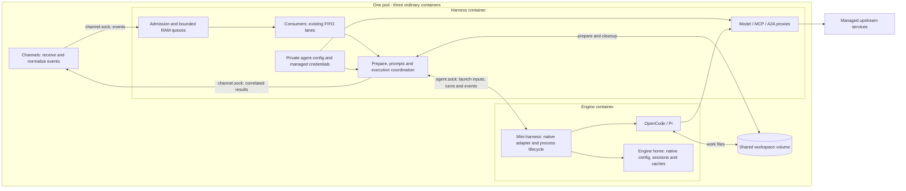
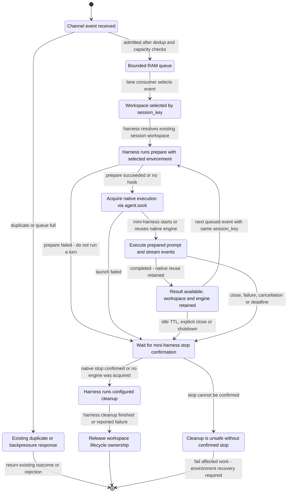

# ach-agent

[](https://github.com/ackstorm/ach-agent/actions/workflows/ci.yml)
[](LICENSE)

`ach-agent` is a **Python execution runtime** for managed AI agents. It receives work from
channel adapters (`webhook`, `webhook-script`, `cron`, `queue`, `a2a`), orders it through a
bounded FIFO **router**, and runs OpenCode or Pi through their native adapters. The harness
coordinates work and brokers access to managed models and tools.

It consumes a frozen, rendered config seam and is control-plane-agnostic: it never reads CRDs,
talks to the Kubernetes API server, or reports status upward — whatever renders the config
(in ACH deployments, the `ach-runtime` Go operator) owns that. It is designed for platform /
AI-engineering teams running managed AI agents (e.g. a GitLab MR reviewer); ACH is the
reference consumer, not a dependency.

## Core value — the router

The one thing that must always hold: **the router is correct.** It enforces per-session FIFO
lanes with the pinned ordering `dedup → backpressure → lane` and three always-enforced finite
bounds (`maxConcurrentInvocations`, `maxInvocationSeconds`, `maxQueuedTotal`). This is what
prevents duplicate firing, queue starvation under redelivery floods, and unbounded resource
use. Its behavior is pinned by an authoritative conformance suite (`make conformance`).

## How it works

The diagrams below describe the simplified split implemented on `feat/phase1-split`.
The [validation report](docs/reports/unix-split-validation.md) records the full gate,
real three-container runs and native TUI checks. Image publication and the external
ACH operator rollout are separate from this implementation.

**Behavioral reference: the original agent, v0.16.1 (`462912f`), before the split.**
The goal is to preserve its behavior while separating processes and simplifying our
added transport/bootstrap code. Workspace selection, hook semantics, session reuse,
prompts and queue policy are not new features or redesign opportunities.



The existing router already owns the in-memory queues and their consumers. No extra
broker is required now. A future durable handoff can change that transport; existing
Redis source channels remain supported independently. Admission is not durable completion.

### Workspace and execution states

This is the lifecycle of a session workspace, including warm reuse. Normal events enter
through admission before reaching the lane; the warm-reuse arrow refers to the next
already-admitted event for that same lane.



**Workspace by `session_key` is existing behavior, not a new layout.** Preserve the
current `workspace_dir(work_dir, session_key)` mapping and existing directories. H and E
mount the same volume at the same workspace path: files written by H are immediately
visible to E, without copying, bundles or artifact transfer.

| Concept | Responsibility |
| --- | --- |
| `session_key` / lane key | Selects the existing workspace and FIFO execution lane |
| Conversation key | Selects native conversation reuse via existing `session: none / auto / custom` behavior; may differ from the lane key |
| Workspace | H/E shared work files; same key reuses the same directory |
| Engine home | E-owned native configuration, sessions and caches; H does not need this mount |
| Public hydrated context | H writes, E reads; visible through the existing workspace context link |

The harness selects the channel's configured `prepare` and `cleanup`, resolves their
environment and event variables, and executes them against the shared workspace.
All such hooks run in H, including hooks without credentials. Script authors own Git,
push and checkout policy; this target does not force private cloning, inspect hooks,
or replace workspace contents. It therefore does not protect credentialed scripts
from configuration left in that shared checkout. Existing process deadlines, basic
path handling and output limits remain.

This restores the original hook contract: prepare runs after admission on the lane,
before engine acquisition, with `cwd = ACH_WORKSPACE`; cleanup is best-effort at
teardown with `cwd = ACH_WORKSPACE.parent`. Hook `HOME` remains `ACH_WORKSPACE`,
which is distinct from the native engine's home. Existing hook environment selection
and event-value validation are preserved, including for hooks using credentials.

Cleanup belongs to workspace teardown, **not automatically to every response**. Warm
reuse keeps the workspace until its existing lifecycle says to close it; destructive
cleanup waits for native stop confirmation. Script-only `webhook-script` work runs in
H under its separate concurrency limit and bypasses engine acquisition.

### What crosses agent.sock

H owns the private config and hydration. It sends only explicit native launch inputs:
model/proxy/MCP settings, workspace, limits and the selected environment **names and
values** resolved from `engine.forwardEnv`. Managed ACH credentials stay in H; an
explicitly forwarded custom secret is deliberately visible to E. No whole-environment
copy and no private config document are sent.

The mini-harness generates `opencode.json` or Pi's equivalent when it launches the
native engine. Turns then carry the prepared prompt and correlated execution IDs;
the native configuration is not resent with every prompt. H interprets channel
configuration; E does not receive channel scripts or need to parse the full channel.

Both internal endpoints use HTTP over Unix sockets with existing request/event types.
There is no internal HMAC or TCP control port. Socket directories are mounted only
into their participants. Public ingress and capability proxies keep the networking
their clients need. Local use keeps the parent-owned launcher and native TUI.

See the [target specification](docs/superpowers/specs/2026-09-13-unix-split-simplification.md)
and [implementation/simplification plan](docs/superpowers/plans/2026-09-14-preserve-behavior-simplify-split.md).

## Quick start (local dev)

All tooling runs inside a content-addressed devtools container — **no host pip/venv**. The only
prerequisites are Docker and `make`.

```bash
make hooks       # install the pre-push gate
make deps        # sync dependencies into the devtools layer
make lint        # ruff check + format --check + mypy --strict
make test        # pytest (unit + integration, excludes e2e)
make conformance # CONTRACT §6 conformance suite (the router IP)
make verify      # full local gate: lint + test + conformance + secrets
make e2e         # full end-to-end stack (compose up → assertions → teardown)
```

Run `make` with no target for the full self-documenting target list.

## Configuration

The harness boots from a single rendered config file (JSON) plus a small `ACH_*` environment
contract. See [`.env.example`](.env.example) for the variables. In production these are rendered
into the pod by `ach-runtime`; for local runs you provide them yourself.

| Variable | Purpose |
|----------|---------|
| `ACH_CONFIG_PATH` | Path to the rendered runtime config (default `/etc/ach-agent/config.json`). |
| `ACH_BASE_URL` | ACH endpoint. Overrides `capability.ach.baseUrl` when set, so a config can ship without a hardcoded host (required if the config omits `baseUrl`). |
| `ACH_API_KEY` | `ek_` bearer for the engine — never logged; dereferenced only at runtime. |

Channel credentials (`GITLAB_TOKEN`, …) are supplied per the channels your config enables.

### Channel prompts (`{{ }}` templating)

A channel may carry a `prompt` — the per-invocation instruction handed to the engine. It is
rendered through a small, zero-dependency `{{ }}` substitution engine against the inbound event,
so one channel can adapt its prompt to each event:

```yaml
channels:
  - name: gitlab-mr-review
    type: webhook
    source: gitlab
    prompt: "Review merge request {{ payload.object_attributes.url }} in {{ payload.project.path_with_namespace | default(\"this repo\") }}."
```

**Namespaces** (the roots a token may reference):

| Root | What | Available on |
|------|------|--------------|
| `payload.*` | the inbound JSON body, dotted path (`payload.commits.0.id` indexes lists) | webhook, queue, a2a |
| `internal.*` | harness facts: `channel.name` / `channel.type` / `channel.source`, `agent.name`, `memory.bank`, `event.id`, `session.key` | all channels |
| `header.*` | reserved — inbound headers are not yet carried across the channel→router seam (always resolves empty) | — |

**Syntax:** `{{ path }}`, whitespace-insensitive. One filter, `{{ path | default("fallback") }}`,
supplies a value when the path is missing. A missing token with no default renders empty.

**There is no `env` namespace.** Process environment — where the `ek_` bearer lives — is
structurally unreachable from a template; the resolver only ever walks the event data. A channel
without a `prompt` keeps the built-in per-channel instruction behavior unchanged.

The memory block's `bank` field names the static memory bank_id (the agent's mission namespace,
e.g. `gitlab-pr-review`).

## Deployment

In production the harness is **not** deployed by hand — the **`ach-runtime` operator** builds
the `Deployment` from your `Agent` CRD (it owns the deployment profile — cpu/mem, replicas,
scaling — and renders the runtime config into the pod). The harness has no Kubernetes RBAC and
never talks to the API server; see [`docs/schemas/operator-contract.md`](docs/schemas/operator-contract.md) §1.

For local/standalone runs use the container directly — see [Getting started](docs/getting-started.md).

Released container images are published to `ghcr.io/ackstorm/ach-agent`.

### Phase 1 split packaging example

The Unix-socket implementation has passed local validation. The repository
includes a tested three-container contract example in [`docker/split/`](docker/split/):
channels (C), harness (H), and one engine (E), all ordinary containers in one pod
with one active replica. Each role uses tini and its role argument; no init container
or operator control-plane sidecar is required.

H alone reads the full rendered config, hydrates state and starts model/MCP proxies.
C receives source-only channel inputs over
`/run/ach-agent/channels/channel.sock`. E receives `PublicEngineConfig` through the
existing controller request over `/run/ach-agent/engine/agent.sock`. H resolves the
values selected by `engine.forwardEnv` and sends those explicit values to E; managed
ACH/model/MCP credentials remain H-side. H executes every prepare and cleanup hook
on the existing shared workspace, preserving the original cwd, HOME and lifecycle.

The two IPC directory mounts are separate: H writes the channels directory and C
connects through its read-only mount; E writes the engine directory and H connects
through its read-only mount. H/E probes use
HTTP over their Unix sockets; C's public ingress remains on port 8080, and native,
model and MCP HTTP endpoints remain where their existing clients require them. There
are no mandatory internal control ports, bootstrap files, bootstrap keys or internal
operator environment variables. These files do not change the CR schema or publish
an image; production `ach-runtime` rendering remains a separate handoff.

The images are built with `--target harness`, `--target channels`,
`--target engine-opencode`, and `--target engine-pi`. A build without a target
continues to produce the combined native image with both Pi and OpenCode and
the existing `--tui` / `--prompt` launch modifiers. E images include tini as
PID 1. Production `ach-runtime` rendering remains a separate handoff; these
files do not apply a cluster or replace operator-generated config and Secret
objects. See [`docker/split/README.md`](docker/split/README.md) for persistence,
ephemeral mounts, custom engine paths, and the offline codemem relocation.

The self-contained operator handoff is [`2026-09-14-unix-operator-handoff.md`](docs/superpowers/specs/2026-09-14-unix-operator-handoff.md).

### Operator contract

The seam between the **`ach-runtime` operator** (Go) and this harness (Python) is one contract
in two halves, kept side by side in [`docs/schemas/`](docs/schemas/):

| Half | File | Role |
|---|---|---|
| Prose | [`operator-contract.md`](docs/schemas/operator-contract.md) | The frozen interface — hydration, egress, auth headers, channel semantics. Pins contract revision **v3**. |
| Machine-readable | [`agent-config-v1.schema.json`](docs/schemas/agent-config-v1.schema.json) | §2 rendered as JSON Schema. **Authoritative for field names, types and defaults.** |

The schema is generated from `AgentConfig` by `scripts/gen_schema.py` (`make schema`) and
drift-guarded by `tests/config/test_schema_artifact.py`. Its canonical `$id` is:

```
https://ackstorm.github.io/ach-agent/stable/schemas/agent-config-v1.schema.json
```

`ach-runtime` also vendors a copy, guarded by its own `TestSchema_NoDrift` against this path.
**Neither repo may change the contract unilaterally** — regenerate here, re-vendor there, in
the same change.

## Contributing

See [CONTRIBUTING.md](CONTRIBUTING.md) and the [Code of Conduct](CODE_OF_CONDUCT.md). Run
Run `make verify` for the full local gate; the pre-push hook checks only commits being pushed.
Security issues: see
[SECURITY.md](SECURITY.md).

## License

Apache-2.0 — see [LICENSE](LICENSE) and [NOTICE](NOTICE).
